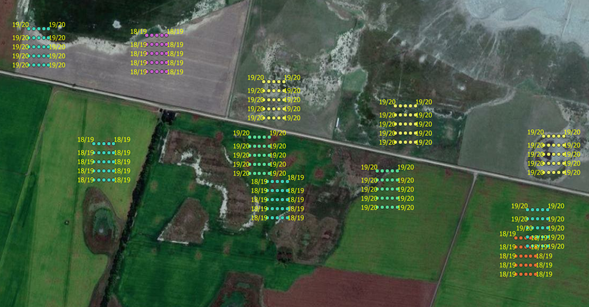
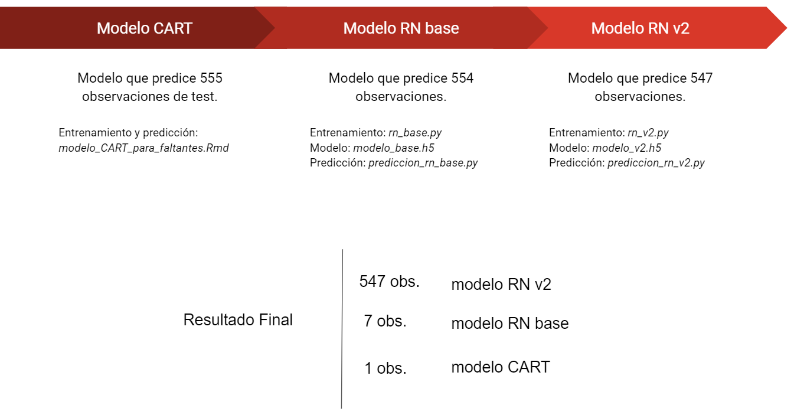

```{r setup, include=FALSE}

knitr::opts_chunk$set(echo = FALSE, 
                      message = FALSE, 
                      eval = TRUE, 
                      comment = "", 
                      warning = FALSE,
                      fig.align='center',
                      dpi = 100,
                      bootstrap.thumbnail = FALSE)

library(tidyverse)
library(sf)
```

## Requerimientos

El preprocesamiento se hizo con R y lo modelos en Python por lo que es necesario contar con ambos programas para poder replicar todo el proceso.

Asismismo, es necesario instalar la siguientes librerias.

Librerias R: `tidyverse`, `sf` y `raster`.

Librerias Python: `pandas`, `numpy`, `pyreadr`, `sklearn`, `tensorflow`, `keras` y `os`.


## Datos

Al dataset de entrenamiento original `train` se le aplicaron distintas transformaciones:

* Se aumentó la cantidad de datos tomando puntos alrededor de los puntos de train. Esta fue una recomendación sugerida por Alfredo Campos en su webinar.
* Se extrajo para cada punto (originales y aumentados) las bandas 2 (azul), 3 (verde), 4 (rojo), 8 (nir) y 11 (swir) del satélite Sentinel-2 para todas las fechas con baja presencia de nubes entre las fechas 2018-10-04 y 2019-07-06, en el caso de la Campaña 18/19, y 2019-09-14 a 2020-07-25, en el caso de la campaña 19/20. Se cuenta con 17 y 20 imágenes para cada campaña respectivamente.
* Se generaron las variables/bandas ndwi, ndvi, evi,  PSSRb1 (pigment specific simple ratio B1), barren_soil y savi a partir de las bandas anteriores.
* Se hizo una interpolación lineal y loess con periodicidad diaria para completar datos faltantes (por ausencia de imágenes). Se calculó el promedio de cada variable cada diez días.
* Siguiendo las recomendaciones de los webinars de Yanina Bellini y el trabajo de [Santiago Banchero](https://inta.gob.ar/sites/default/files/mapa_nacional_de_cultivos_campana_2018_2019.pdf) se extrajeron los ejidos urbanos y cuerpos de agua estable utilizando capas SIG del [Instituto Geográfico de la Nación](https://www.ign.gob.ar/NuestrasActividades/InformacionGeoespacial/CapasSIG).

A continuación se describe con mayor detalle algunos de los puntos anteriores.

#### Aumento de los datos

A partir del dataset de entrenamiento original `train` se aplicaron distintas transformaciones. En primer lugar, para aumentar la cantidad de observaciones se tomaron puntos alrededor de los puntos origniales a los que se les asigno la misma etiqueta que el dato original (ver Figura 1). Esto nos permite captar mayor variabilidad en los lotes que tienen la misma clase.




#### Imágenes e índices 

Se extrajo para cada punto (originales y aumentados) las bandas 2 (azul), 3 (verde), 4 (rojo), 8 (nir) y 11 (swir) del satélite Sentinel-2 para todas las fechas con baja presencia de nubes entre las fechas 2018-10-04 y 2019-07-06 en el caso de la Campaña 18/19, y 2019-09-14 a 2020-07-25, en el caso de la campaña 19/20. Se cuenta con 17 y 20 imágenes para cada campaña respectivamente.

Se generaron las variables/bandas NDWI, NDVI, EVI, PSSRb1 (pigment specific simple ratio B1), barren_soil y SAVI a partir de las bandas anteriores.

A continuación, en la Figura 2, se muestra la evolución de la mediana del EVI para las distintas clases del dataset. Se puede apreciar que la dinámica de esta variables difiere en las distintas clases.

```{r,  fig.cap='Figura 2: Evolución de EVI para las distintas clases del dataset'}
train <- read.csv("../dataset/data_train.csv")
test <- read.csv("../dataset/data_test.csv")

train <- sf::st_as_sf(train, coords=c("Longitud","Latitud"), crs = 4326)
test <- sf::st_as_sf(test, coords=c("Longitud","Latitud"), crs = 4326)

df_cultivos <- bind_rows(train,test)

nombres_df_bandas <- list.files(path = "../dataset/raw/bandas_procesadas/")

df_bandas <- tibble()

for (i in nombres_df_bandas) {
  tmp <- read.csv( paste0( "../dataset/raw/bandas_procesadas/",i),stringsAsFactors = F) %>%
    mutate(fecha =as.Date(fecha,"%Y-%m-%d"),
           Campania = case_when(fecha<as.Date("2019-08-01", format="%Y-%m-%d")~"18/19",
                                fecha >as.Date("2019-08-01", format="%Y-%m-%d")~"19/20",
                                          T~NA_character_))
  
  df_bandas <- bind_rows(df_bandas,tmp )
}

df_bandas <- df_cultivos %>% left_join(df_bandas, by=c("GlobalId"="GloblaId","Campania" ))

df_bandas <- df_bandas %>% mutate_if(.tbl = .,.predicate = is.numeric,.funs = function(x){ifelse(x==0,NA,x)})

df_bandas <- df_bandas %>% mutate(n_dia_campania = fecha - as.Date(paste0("20",str_sub(string = Campania,start = 1,end = 2),"-09-01")) ,
                                  id_campana = case_when(Campania=="18/19"~1,
                                                         T~2)) 

df_bandas <- df_bandas %>% as_tibble()

df_bandas %>% as_tibble() %>%  group_by(Cultivo, fecha ) %>%
  summarise(mediana = median(evi, na.rm = T),
             promedio = mean(evi, na.rm = T),
            p_25 = stats::quantile(evi, probs = .25, na.rm=T),
            p_75 = stats::quantile(evi, probs = .75, na.rm=T)) %>%
  ggplot(aes(as.Date(fecha),mediana,group=Cultivo, col= mediana))+
  geom_line(size=1.05)+
  #geom_line(aes(as.Date(fecha), promedio))+
  #geom_line(aes(as.Date(fecha), p_25),color="darkred")+
  #geom_line(aes(as.Date(fecha), p_75),color="darkblue")+
  facet_wrap(~Cultivo)+scale_x_date()+
  labs(title = 'Evolución de EVI para las distintas clases del dataset', x='Fecha', y='Mediana EVI', col ="EVI")+
  theme_bw()+ theme(plot.title = element_text(hjust = .5),axis.text.x = element_text(angle=90))

```

Dado que en algunas oportunidades la presencia de nubes impedía obtener información para algunas fechas se completó las fechas faltantes aplicando dos técnicas de interpolación: un método lineal y uno loess. 

En la Figura 3 se muestra la evolución de la mediana del EVI con interpolación loess cada 10 días desde el 1 de octubre de cada año.

```{r loess, echo=FALSE,  fig.cap='Figura 3: Evolución de EVI con interpolación loess para las distintas clases del dataset'}
nombres_df_bandas <- list.files(path = "../dataset/raw/loop_df_aumentado/")

df_bandas <- tibble()


for (i in nombres_df_bandas) {
  tmp <- readRDS( file = paste0( "../dataset/raw/loop_df_aumentado/",i))
  
  df_bandas <- bind_rows(df_bandas,tmp )
}


df_bandas %>% as_tibble() %>%  group_by(Cultivo,Campania, g10_dias ) %>%
  summarise(mediana = median(fit_evi, na.rm = T) ) %>%
  ggplot(aes(g10_dias*10/30,mediana,group=Campania, col= Campania))+
  geom_line(size=1.05)+
  #geom_line(aes(as.Date(fecha), promedio))+
  #geom_line(aes(as.Date(fecha), p_25),color="darkred")+
  #geom_line(aes(as.Date(fecha), p_75),color="darkblue")+
  facet_wrap(~Cultivo)+#scale_x_date()+
  labs(title = 'Evolución de EVI con interpolación loess para las distintas clases del dataset', x='Meses desde octubre para cada año', y='Mediana EVI', col ="Campaña")+
  theme_bw()+ theme(plot.title = element_text(hjust = .5))
```

En la Figura 4 se muestra la evolución de la mediana del EVI con interpolación lineal cada 10 días desde el 1 de octubre de cada año.

```{r lineal, echo=FALSE,  fig.cap='Figura 4: Evolución de EVI con interpolación lineal para las distintas clases del dataset'}
df_bandas %>% as_tibble() %>%  group_by(Cultivo,Campania, g10_dias ) %>%
  summarise(mediana = median(evi, na.rm = T) ) %>%
  ggplot(aes(g10_dias*10/30,mediana,group=Campania, col= Campania))+
  geom_line(size=1.05)+
  #geom_line(aes(as.Date(fecha), promedio))+
  #geom_line(aes(as.Date(fecha), p_25),color="darkred")+
  #geom_line(aes(as.Date(fecha), p_75),color="darkblue")+
  facet_wrap(~Cultivo)+#scale_x_date()+
  labs(title = 'Evolución de EVI con interpolación lineal para las distintas clases del dataset', x='Meses desde octubre para cada año', y='Mediana EVI', col ="Campaña")+
  theme_bw()+ theme(plot.title = element_text(hjust = .5))
```

### Datasets finales

El primer dataset es el utilizado por el modelo CART, cada columna del dataset `df_cultivos.rds` corresponde al valor de la banda (EVI, SAVI, NDVI, etc) en la fecha original de la imágen Sentinel-2 (es decir sin interpolar). Este dataset está conformado por 332 variables y 1405 observaciones. El archivo de test contiene el total de las 555 observaciones a predecir.

El segundo dataset es `df_rn_base.csv`, el cual surge de realizar los pasos descriptos en la sección previa y se seleccionan 325 variables que no contaban con faltantes en el dataset de test. Este archivo contiene 20749 observaciones y el archivo de test tiene 554 observaciones de las 555 que se deben predecir.

Por último, el dataset `df_train_rn_full_v2.csv` surge de realizar los pasos descriptos anteriormente conservando 525 variables y 20520 observaciones. El archivo de test contiene 547 de las 555 observaciones que se deben predecir.

Todos los datasets se encuentran en la carpeta `datasets/raw`.

## Modelado

Se construyeron tres modelos para la predicción final. El primer modelo consiste en un árbol de decisión CART que se entrena con el dataset `df_cultivos.rds`. Como el algoritmo CART puede trabajar con faltantes nos proporcionara una predicción para las 55 observaciones de test.

El segundo modelo, denominado `modelo_base` es una red neural feed forward con dos capas densas que se entrena con el dataset `df_rn_base.csv`. 

El último modelo denominado `modelo_rn_v2` se trata de la misma red neuronal feed forward pero entrenada con el dataset `df_train_rn_full_v2.csv`. Con este modelo se obtienen 547 predicciones.

En la figura 5 se puede ver un resumen de todos los modelos.



En la carpeta `../code/` se encuentran los scripts de los tres modelos.

## Reproducción de resultados

En primer lugar se deben generar los resultados del modelo CART para todas las observaciones mediante el código `modelo_CART_para_faltantes.Rmd`.

Luego, se debe entrenar la red neuronal y predecir con el modelo base. En la carpeta `../code/modelo_base/` se encuentran los archivos `rn_base.py`, en el que se entrena la red neuronal, el modelo entrenado `modelo_base.h5` y el archivo `prediccion_rn_base.py` con el que se realizan las predicciones. En este último código de predicción se incluye el resultado del modelo CART.

Por último, en la carpeta `../code/RN_v2/` se encuentran los archivos `rn_v2.py` en el que se entrena el modelo principal, su resultado en `modelo_v2.h5` y el archivo `prediccion_rn_v2.py` con el que se realizan las predicciones finales. Este archivo de predicciones finales incluye la concatenación con los resultados del modelo base y el CART.

Los resultados de cada modelo se guardaron en su respectiva carpeta. El resultado final enviado se encuentra tanto como salida del primer modelo en la carpeta en `../code/RN_v2/` y en la carpeta de `resultado`.


